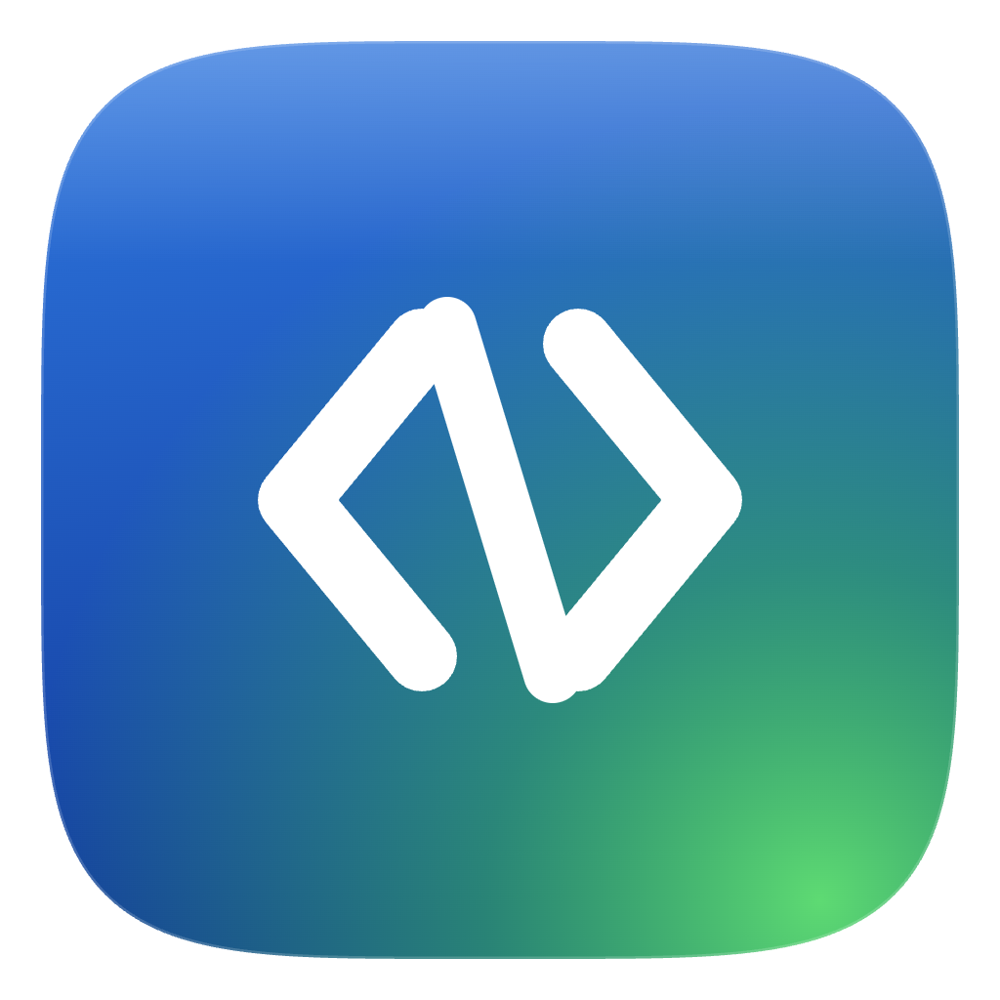
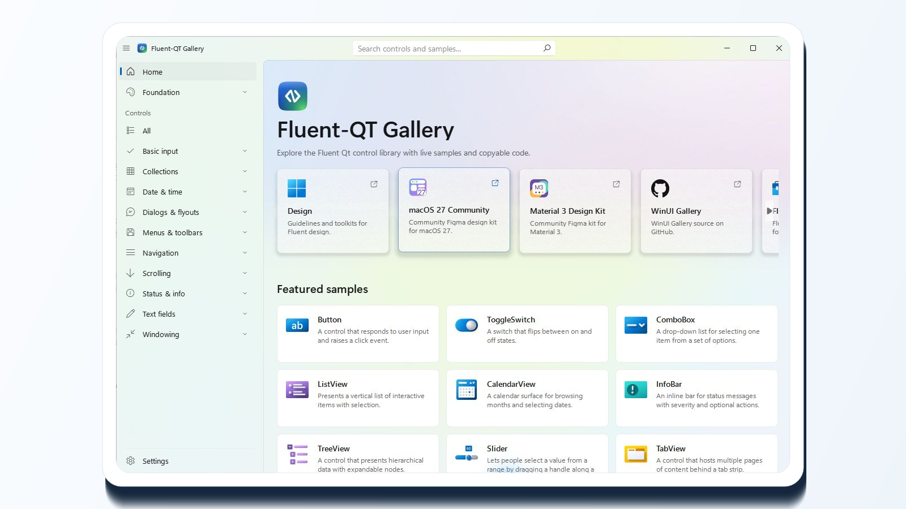

<p align="center">
  English | <a href="README.zh-CN.md">简体中文</a>
</p>

<p align="center">
  
</p>

<h1 align="center">Fluent-Qt</h1>

<p align="center">
  A modern Fluent component library for Qt Widgets.
  <br>
  Build native desktop experiences with C++17, reusable components, design tokens, themes, and a live Gallery app.
</p>

<p align="center">
  <a href="https://github.com/calvinhxx/Fluent-Qt/actions/workflows/ci.yml"></a>
  <a href="LICENSE"></a>
  
  
  
  
</p>

<p align="center">
  
</p>

## ✨ Positioning

Fluent-Qt brings modern desktop UI capabilities to traditional Qt Widgets applications. It does not require moving to QML; instead, it provides reusable components, design specifications, theme infrastructure, and a runnable Gallery on top of the native Widgets stack.

| Native Widgets | Design System | Gallery Validation |
|---|---|---|
| Keeps the C++/Qt Widgets application model. | Uses Fluent as the baseline, with Material 3 and macOS style branches. | Demonstrates component states, theme switching, and sample code in a real app. |

## 🧭 Support Matrix

| Platform | Architecture | Delivery |
|---|---|---|
| Windows | x64 / ARM64 | Debug, Release, installer |
| macOS | arm64 / x64 | Debug, Release, DMG |

## 🧱 Dependencies

| Category | Requirement |
|---|---|
| Language | C++17 |
| UI runtime | Qt 5.15+ or Qt 6.2+ |
| Build | CMake, vcpkg |
| Test / logging | GTest, spdlog |

## 🧩 Component Scope

Fluent-Qt covers core desktop UI surfaces including basic input, collections, navigation, overlays, text input, date and time, menus and toolbars, scrolling, status feedback, and windowing.

## 🚀 Quick Start

macOS:

```bash
export VCPKG_ROOT=/path/to/vcpkg
cmake --preset vcpkg-osx
cmake --build --preset vcpkg-osx
ctest --preset vcpkg-osx --output-on-failure
```

Windows:

```powershell
$env:VCPKG_ROOT = "D:\path\to\vcpkg"
cmake --preset vcpkg-windows
cmake --build --preset vcpkg-windows
ctest --preset vcpkg-windows --output-on-failure
```

## 📦 Packaging

macOS:

```bash
cmake --preset vcpkg-osx-release
cmake --build --preset vcpkg-osx-release
cpack --preset vcpkg-osx-dmg
```

Windows:

```powershell
cmake --preset vcpkg-windows-release
cmake --build --preset vcpkg-windows-release
cpack --preset vcpkg-windows-installer
```

## 📚 Documentation

| Development | Testing | Architecture | Design |
|---|---|---|---|
| [Development workflow](docs/development/README.md) | [Testing workflow](docs/development/testing-workflow.md) | [Architecture contracts](docs/architecture/README.md) | [Design language references](docs/design-languages/README.md) |
| [Release governance](docs/development/release-governance.md) | [Visual review](docs/development/visual-review.md) | [Overlay behavior](docs/architecture/overlay-behavior.md) | [Figma sources](docs/design-languages/figma-sources.md) |
| [Packaging workflow](docs/development/packaging-workflow.md) |  |  |  |

## 🔗 References

| Entry | Purpose |
|---|---|
| [Windows UI Kit (Community)](https://www.figma.com/design/qpecbg7hOfos9DcHWeKlfw/Windows-UI-kit--Community-?node-id=2434-129659) | Fluent / Windows visual baseline |
| [macOS 27 UI Kit (Community)](https://www.figma.com/design/W0PjLoNXuQyLACYlAE3QKi/macOS-27--Community-?node-id=131-8996) | Reference for the macOS style branch |
| [Material 3 Design Kit (Community)](https://www.figma.com/design/sfn7GB1zXX6Lu8hfhYqhbA/Material-3-Design-Kit--Community-?node-id=49823-12141) | Reference for the Material 3 style branch |
| [WinUI Gallery](https://github.com/microsoft/WinUI-Gallery) | Reference for component semantics and sample experience |

## ⭐ Star History

<p align="center">
  <a href="https://www.star-history.com/#calvinhxx/Fluent-Qt&Date">
    <picture>
      <source media="(prefers-color-scheme: dark)" srcset="https://api.star-history.com/svg?repos=calvinhxx/Fluent-Qt&type=Date&theme=dark">
      
    </picture>
  </a>
</p>

## License

Fluent-Qt is released under the [MIT License](LICENSE).
