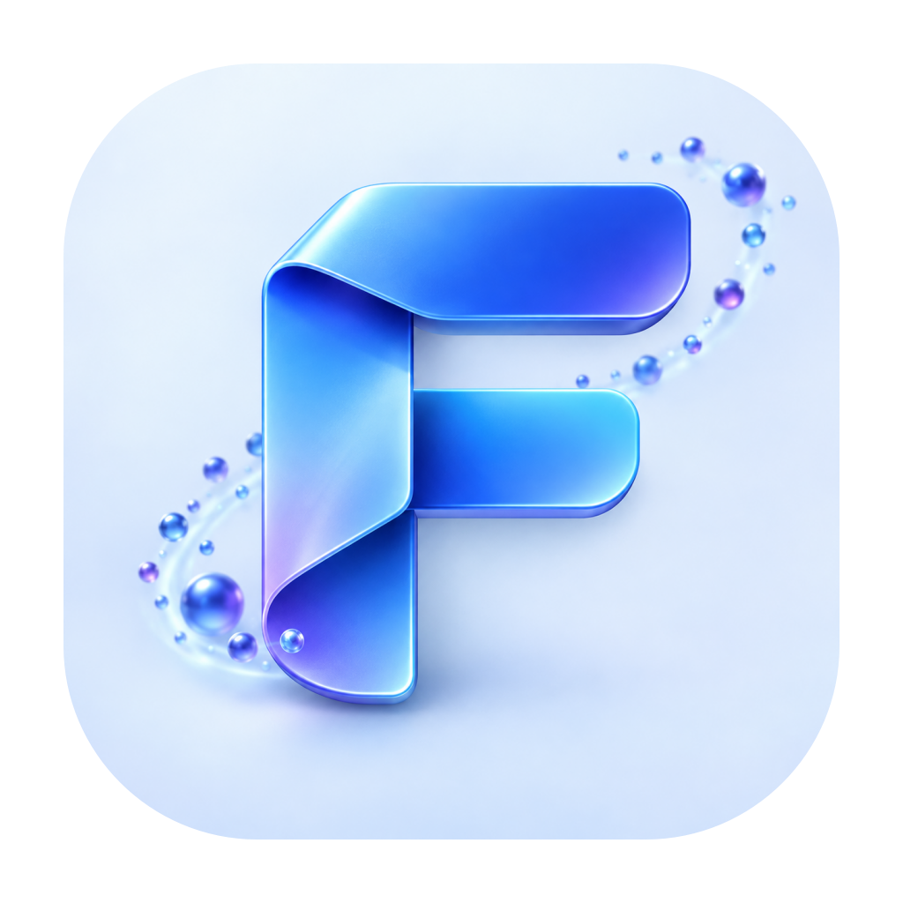
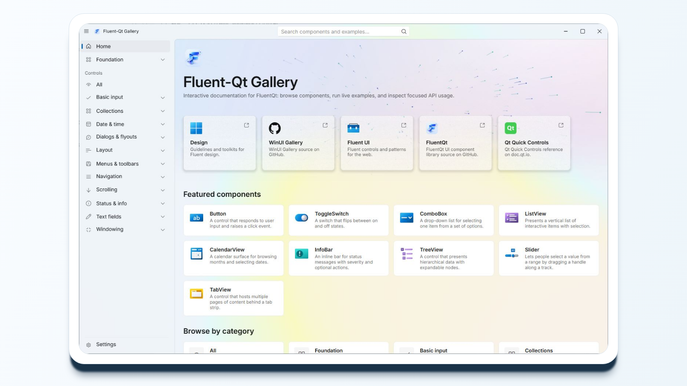

<p align="center">
  <a href="README.md">English</a> | 简体中文
</p>

<p align="center">
  
</p>

<h1 align="center">Fluent-Qt</h1>

<p align="center">
  面向 Qt Widgets 的跨平台 Fluent 风格 C++ UI 组件库。
</p>

<p align="center">
  <a href="https://github.com/calvinhxx/Fluent-Qt/actions/workflows/ci.yml"></a>
  <a href="https://github.com/calvinhxx/Fluent-Qt/stargazers"></a>
  <a href="LICENSE"></a>
  
  
  
  
  <a href="https://pypi.org/project/FluentQt/"></a>
</p>

<p align="center">
  <a href="https://calvinhxx.github.io/Fluent-Qt/#top"></a>
</p>

<p align="center">
  <strong><a href="https://calvinhxx.github.io/Fluent-Qt/#gallery">实时体验 C++ Web Gallery</a></strong>
  ·
  <a href="https://calvinhxx.github.io/Fluent-Qt/#top">项目官网</a>
</p>

集合类组件包括 ListView、GridView、FlowView、TreeView 和 DataGrid。DataGrid 沿用 Qt 的模型与委托所有权约定，大数据表格的工作量保持在可视区域内。

## 🧱 依赖

| 范围 | 依赖 |
|---|---|
| FluentQt C++ 组件库 | C++17、CMake 3.16+、Qt Widgets 5.15+ 或 6.2+ |
| C++ Gallery | FluentQt、Qt Network、spdlog/fmt |
| C++ WebAssembly | Qt 6.9.3 `wasm_singlethread`、Emscripten 3.1.70 |
| 测试 | FluentQt、Qt Test/Network、GTest、spdlog/fmt |
| 可选 PySide6 绑定 | Qt 6.2+；源码构建支持 Python 3.10+ |

## 🤖 AI 辅助开发

可安装的 [`build-fluentqt-gui`](.agents/skills/build-fluentqt-gui/SKILL.md) Skill 支持 Codex、Claude Code、Cursor 和 GitHub Copilot，为现有或全新项目构建达到 Gallery 完成度的 C++ 或 PySide6 GUI，并覆盖组件选择、主题与视觉精调。详见 [AI 辅助开发指南](docs/ai/README.md)。

## 🚀 快速开始

### C++ 集成方式

| 集成方式 | CMake |
|---|---|
| `FetchContent` 集成 | `FetchContent_MakeAvailable(fluentqt)` |
| 源码集成 | `add_subdirectory(Fluent-Qt)` |
| 安装包集成 | `find_package(FluentQt CONFIG REQUIRED)` |

#### `FetchContent` 集成

```cmake
cmake_minimum_required(VERSION 3.16)
project(my_app LANGUAGES CXX)

set(CMAKE_CXX_STANDARD 17)
set(CMAKE_CXX_STANDARD_REQUIRED ON)

include(FetchContent)
FetchContent_Declare(
    fluentqt
    GIT_REPOSITORY https://github.com/calvinhxx/Fluent-Qt.git
    GIT_TAG v1.6.4
    GIT_SHALLOW TRUE
)
FetchContent_MakeAvailable(fluentqt)

add_executable(my_app main.cpp)
target_link_libraries(my_app PRIVATE FluentQt::FluentQt)
```

#### 源码集成

将 Fluent-Qt 源码放入项目的 `Fluent-Qt` 目录：

```cmake
cmake_minimum_required(VERSION 3.16)
project(my_app LANGUAGES CXX)

set(CMAKE_CXX_STANDARD 17)
set(CMAKE_CXX_STANDARD_REQUIRED ON)

add_subdirectory(Fluent-Qt)

add_executable(my_app main.cpp)
target_link_libraries(my_app PRIVATE FluentQt::FluentQt)
```

#### 安装包集成

```cmake
cmake_minimum_required(VERSION 3.16)
project(my_app LANGUAGES CXX)

set(CMAKE_CXX_STANDARD 17)
set(CMAKE_CXX_STANDARD_REQUIRED ON)

find_package(FluentQt CONFIG REQUIRED)

add_executable(my_app main.cpp)
target_link_libraries(my_app PRIVATE FluentQt::FluentQt)
```

如果 FluentQt 不在系统搜索路径中，配置时传入 `-DCMAKE_PREFIX_PATH=/path/to/fluentqt`。

### C++ 最小示例

`main.cpp`：

```cpp
#include <FluentQt/FluentQt.h>

#include <QApplication>
#include <QVBoxLayout>
#include <QWidget>

int main(int argc, char* argv[])
{
    fluent::prepareHighDpiApplication();
    QApplication app(argc, argv);
    fluent::initializeResources();
    app.setFont(Typography::fontStyle(Typography::FontRole::Body).toQFont());

    fluent::windowing::Window window;
    window.setWindowTitle(QStringLiteral("FluentQt Hello World"));
    window.resize(480, 320);

    auto* content = new QWidget;
    auto* layout = new QVBoxLayout(content);
    layout->setContentsMargins(32, 32, 32, 32);

    auto* button = new fluent::basicinput::Button(
        QStringLiteral("Hello from FluentQt"), content);
    button->setFluentStyle(fluent::basicinput::Button::Accent);
    layout->addStretch();
    layout->addWidget(button, 0, Qt::AlignCenter);
    layout->addStretch();

    window.setContentWidget(content);
    window.show();
    return app.exec();
}
```

完整工程见 [`examples/hello_world`](examples/hello_world/)，IDE 中可直接运行 `fluentqt_hello_world` target。

### 可选 Python 兼容

PySide6 兼容层通过 Shiboken6 将 Fluent-Qt 的原生 C++ 控件提供给 Python 使用。

```bash
python -m pip install FluentQt
```

```python
import sys

import fluentqt
from PySide6.QtCore import Qt
from PySide6.QtWidgets import QApplication, QVBoxLayout, QWidget
from fluentqt.basicinput import Button
from fluentqt.windowing import Window

def main() -> int:
    fluentqt.prepare_high_dpi_application()
    app = QApplication(sys.argv)
    fluentqt.initialize_resources()
    app.setFont(fluentqt.font_for_role(fluentqt.FontRole.Body))

    window = Window()
    window.setWindowTitle("FluentQt Hello World")
    window.resize(480, 320)

    content = QWidget()
    layout = QVBoxLayout(content)
    layout.setContentsMargins(32, 32, 32, 32)

    button = Button("Hello from FluentQt", content)
    button.setFluentStyle(Button.ButtonStyle.Accent)
    layout.addStretch()
    layout.addWidget(button, 0, Qt.AlignCenter)
    layout.addStretch()

    window.setContentWidget(content)
    window.show()
    return app.exec()

if __name__ == "__main__":
    sys.exit(main())
```

完整 Python 工程见
[`bindings/pyside6/examples/hello_world`](bindings/pyside6/examples/hello_world/)。

## 🛠 构建

### 组件库

```bash
cmake -S . -B build/fluentqt \
  -DCMAKE_BUILD_TYPE=Release \
  -DCMAKE_PREFIX_PATH=/path/to/Qt
cmake --build build/fluentqt --config Release --target FluentQt --parallel
cmake --install build/fluentqt --config Release \
  --component Development --prefix /path/to/install
```

### 源码包

生成用于离线或源码集成的精简组件库源码包：

```bash
cmake --build build/fluentqt --target fluent_qt_source_package
```

### WebAssembly

使用 Qt 6.9.3 `wasm_singlethread` 和 Emscripten 3.1.70 构建 WebAssembly Gallery：

```bash
source "$HOME/Qt/Tools/emsdk/emsdk_env.sh"
export QT_WASM_ROOT="$HOME/Qt/6.9.3/wasm_singlethread"
export QT_HOST_ROOT="$HOME/Qt/6.9.3/macos"
cmake --preset wasm
cmake --build --preset wasm --parallel
python3 -m http.server 4173 --bind 127.0.0.1 --directory build/wasm
```

浏览器打开 `http://127.0.0.1:4173/app/index.html`。环境配置、测试、CI、部署和平台限制见 [WebAssembly 工作流](docs/development/webassembly-workflow.md)。

## 🖼 Gallery

Gallery 用于浏览、演示和验证 FluentQt 组件。

### C++ Web Gallery

在线体验：[项目官网](https://calvinhxx.github.io/Fluent-Qt/#gallery) · [独立页面](https://calvinhxx.github.io/Fluent-Qt/gallery/)。

### C++ Gallery 安装包

从 [GitHub Releases](https://github.com/calvinhxx/Fluent-Qt/releases/latest) 下载对应平台、Qt 版本和架构的 Gallery：

| 平台 | Qt 5 / x64 | Qt 6 / x64 | Qt 6 / ARM64 | 格式 |
|---|---|---|---|---|
| Windows | 5.15.2 | 6.2.4 | 6.9.3 | `.exe` |
| macOS | 5.15.2 | 6.9.3 | 6.9.3 | `.dmg` |
| Linux | 5.15 | 6.2.4 | 6.2.4 | `.deb` |

### 本地运行 C++ Gallery

| 平台 | x64 preset | ARM64 preset |
|---|---|---|
| Windows | `vcpkg-windows` | `vcpkg-windows-arm64` |
| macOS | `vcpkg-osx-x64` | `vcpkg-osx` |
| Linux | `vcpkg-linux` | `vcpkg-linux-arm64` |

将 `PRESET` 替换为表中的值：

```bash
cmake --preset PRESET
cmake --build --preset PRESET --target fluent_qt_gallery --parallel
```

### 本地打包 C++ Gallery

| 平台 | x64 打包 preset | ARM64 打包 preset | 格式 |
|---|---|---|---|
| Windows | `vcpkg-windows-installer` | `vcpkg-windows-arm64-installer` | `.exe` |
| macOS | `vcpkg-osx-x64-dmg` | `vcpkg-osx-dmg` | `.dmg` |
| Linux | `vcpkg-linux-deb` | `vcpkg-linux-arm64-deb` | `.deb` |

具体本地打包命令见[打包工作流](docs/development/packaging-workflow.md)。

### Python 兼容 Gallery

Python Gallery 通过 [PyPI](https://pypi.org/project/FluentQt-Gallery/) 分发。

```bash
python -m pip install FluentQt-Gallery
python -m fluentqt_gallery
```

`FluentQt-Gallery` 会自动安装对应版本的 `FluentQt`。

## 📚 文档

- [参与贡献](CONTRIBUTING.md)
- [AI 辅助应用开发](docs/ai/README.md)
- [开发工作流](docs/development/README.md)
- [测试与视觉验收](docs/development/testing-workflow.md)
- [打包工作流](docs/development/packaging-workflow.md)
- [发布治理](docs/development/release-governance.md)
- [架构约定](docs/architecture/README.md)
- [设计语言参考](docs/design-languages/README.md)
- [WebAssembly 兼容](docs/development/webassembly-workflow.md)
- [Python 兼容](bindings/pyside6/README.md)

## 🔗 参考

| 来源 | 用途 |
|---|---|
| [Windows UI Kit (Community)](https://www.figma.com/design/qpecbg7hOfos9DcHWeKlfw/Windows-UI-kit--Community-?node-id=2434-129659) | Fluent / Windows 视觉参考 |
| [macOS 27 UI Kit (Community)](https://www.figma.com/design/W0PjLoNXuQyLACYlAE3QKi/macOS-27--Community-?node-id=131-8996) | macOS 风格参考 |
| [Material 3 Design Kit (Community)](https://www.figma.com/design/sfn7GB1zXX6Lu8hfhYqhbA/Material-3-Design-Kit--Community-?node-id=49823-12141) | Material 3 风格参考 |
| [WinUI Gallery](https://github.com/microsoft/WinUI-Gallery) | 组件行为和示例页面参考 |

## 许可证

Fluent-Qt 项目自身的源代码使用 [MIT License](LICENSE) 发布。
项目中捆绑的资源以及发布包中的运行时依赖继续适用各自的上游许可；
具体版本、来源、对应源码提供规则和许可证位置见
[第三方声明](THIRD_PARTY_NOTICES.md)。产品名称、徽标及外部设计参考的相关说明见
[商标与外部引用声明](TRADEMARKS.md)。
