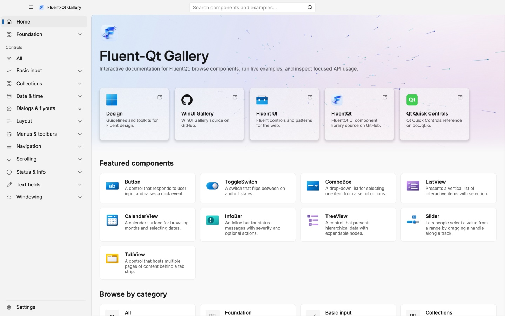

# FluentQt documentation

> **Status:** Current guide (documentation home)

FluentQt documentation is organized by task. Start with the Gallery when you
want to evaluate the library, the API Explorer when you know the component you
need, and the development tree when you are changing the project itself.



## Choose a path

| Goal | Start here | Continue with |
|---|---|---|
| Try controls and copy an example | [WebAssembly Gallery](https://calvinhxx.github.io/Fluent-Qt/app/) | [API Explorer](https://calvinhxx.github.io/Fluent-Qt/api/) |
| Add FluentQt to a C++ or PySide6 application | [Project README](../README.md) | [Onboarding tools](../tools/onboarding/README.md) |
| Add a GUI with a coding agent | [AI-assisted development](ai/README.md) | [Integration workflow](ai/add-gui-to-project.md) |
| Add or change a component | [Development tree](development/README.md) | [Component API conventions](development/component-api-conventions.md) |
| Understand behavior guarantees | [Architecture contracts](architecture/README.md) | [Compatibility policy](development/compatibility-policy.md) |
| Package or release FluentQt | [Packaging workflow](development/packaging-workflow.md) | [Release governance](development/release-governance.md) |
| Ask a question or contribute | [Community](community/README.md) | [Contributing guide](../CONTRIBUTING.md) |

## Documentation tree

Open the [complete table of contents](SUMMARY.md) for every guide, contract,
record, and release note. Leaf pages include breadcrumbs and previous/next
links generated from that tree. The contents also folds in PySide6, onboarding,
and community-policy documents that stay beside the code or package they
describe.

```text
docs/
├── README.md                 this page
├── ai/                       agent discovery and GUI delivery
├── architecture/             runtime and component behavior contracts
├── design-languages/         Fluent visual contract and design sources
├── development/              contributor and maintainer workflows
├── releases/                 immutable release notes
└── community/                support and participation routes
```

## How to read document status

| Status | Meaning |
|---|---|
| **Current guide** | Follow it for work on the active branch. |
| **Living reference** | Generated or maintained alongside the implementation. |
| **Accepted contract** | Describes a public or architectural decision that remains in force. |
| **Historical record** | Preserves dated evidence; do not treat its counts or open items as current. |

Documents that contain changing totals should link to generated data instead
of copying the numbers. The current machine-readable sources are:

- [AI component catalog](ai/generated/fluentqt-ai-catalog.json)
- [Public API catalog](../site/api/catalog.json)
- [Accessibility inventory](development/accessibility-inventory.md)
- [PySide6 API manifest](../bindings/pyside6/api-manifest.json)

Documentation changes follow the concise writing and diagram rules in the
[documentation style guide](development/documentation-style.md).
