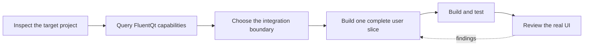

# AI-assisted GUI development

> **Status:** Current guide

[Documentation home](../README.md) · [Contents](../SUMMARY.md)

Use this section when a coding agent is adding a FluentQt interface to an
existing project or creating a new desktop application. The agent should work
from public APIs and repository evidence, not infer an architecture from a CLI
or TUI screenshot.



## Start here

1. Check the local toolchain with `fluentqt doctor`.
2. Query the component catalog for the task, not the whole library.
3. Follow [Adding a GUI to any project](add-gui-to-project.md) to choose an
   integration boundary and a first vertical slice.
4. Use the [`build-fluentqt-gui` Skill](../../.agents/skills/build-fluentqt-gui/SKILL.md)
   when the coding agent supports Agent Skills.
5. Validate the built application with tests, Inspector output, and a visual
   review against the Gallery.

The [API Explorer](https://calvinhxx.github.io/Fluent-Qt/api/) is the quickest
human-readable component reference. The generated catalog is better for tools
because it can return a small, structured result.

## Check and create a project

From a FluentQt checkout or packaged Skill:

```bash
python3 tools/onboarding/fluentqt doctor --profile cpp
python3 tools/onboarding/fluentqt create my-app \
  --language cpp --starter workbench
```

Use `--profile python` and `--language pyside6` for PySide6. The maintained
starters cover two shapes:

| Starter | Use it for | Window ownership |
|---|---|---|
| `existing-qt` | A panel or bounded slice inside an existing Qt application | Host-owned |
| `workbench` | A new desktop application with explicit application and UI boundaries | Application-owned |

See the [onboarding tool reference](../../tools/onboarding/README.md) for
toolchain discovery, JSON reports, dry runs, and first-window trials.

## Query the catalog

Find a component by intent:

```bash
python3 tools/ai/query_ai_catalog.py --search "expandable hierarchy"
python3 tools/ai/query_ai_catalog.py --component tree-view
python3 tools/ai/query_ai_catalog.py --guide navigation
```

Choose an application or integration pattern:

```bash
python3 tools/ai/query_ai_catalog.py --pattern service-client
python3 tools/ai/query_ai_catalog.py --pattern greenfield
python3 tools/ai/query_ai_catalog.py --pattern direct-library --json
```

The catalog narrows the search. It does not replace inspection of the target
project's ownership, event loop, threading, cancellation, persistence, and
public interfaces.

## Choose the integration boundary

Use the decision table and validation checklist in
[Adding a GUI to any project](add-gui-to-project.md). It is the canonical place
for direct-library, service, process, plugin, extraction, and greenfield
boundaries.

## Inspect the built interface

Inspector is read-only. It reports layout, text, input, scrolling, and
accessibility findings without changing the UI.

```cpp
#include <FluentQt/Diagnostics.h>

const QJsonObject report =
    fluent::diagnostics::Inspector::report(window.contentWidget());
```

```python
report = fluentqt.inspect_widget(window.contentWidget())
```

Generated Workbench projects expose the same report with `--quality-report`.
The report format and rule boundaries are defined by the
[Inspector contract](../architecture/inspector-report.md). Appearance still
requires a real Light/Dark, normal/narrow, content, focus, and interaction
review; a zero-finding report is not a design score.

## Use the portable Skill

The repository contains one canonical Skill. Codex, Claude Code, Cursor, and
other compatible agents use the same instructions and assets; there are no
agent-specific copies to keep synchronized.

Invoke it once with the application outcome. The agent owns FluentQt project
analysis, scaffolding or integration, implementation, build, launch,
refinement, and evidence, while requesting input only for material product
decisions.

Build the installable archive:

```bash
python3 tools/ai/package_fluentqt_skill.py \
  --project-root . \
  --output-dir dist
```

The archive contains `build-fluentqt-gui/`, including catalog search,
onboarding commands, maintained starters, design and implementation guidance,
and visual review tools. Agents that discover `.agents/skills/` can use the
repository copy directly.

## Sources of truth

| Information | Canonical source |
|---|---|
| Components, routes, samples, C++/Python names, and tests | [Generated AI catalog](generated/fluentqt-ai-catalog.json) |
| Human-authored selection and integration guidance | [guidance.json](guidance.json) |
| Installed public headers | [API catalog](../../site/api/catalog.json) |
| Built-application review scenes | [Application scene manifest](evals/application-scenes.json) |
| Agent workflow and visual acceptance | [`build-fluentqt-gui` Skill](../../.agents/skills/build-fluentqt-gui/SKILL.md) |
| Project analysis exchange format | [Project analysis schema](project-analysis.schema.json) |

Do not hand-edit generated catalogs or the Skill's catalog snapshot. After a
component, sample, binding, test, or guidance change, run:

```bash
python3 tools/ai/generate_ai_catalog.py --project-root .
python3 tools/ai/evaluate_ai_catalog.py --project-root .
python3 tools/ai/validate_ai_assets.py --project-root .
```

The completed delivery work and benchmark evidence are summarized in the
[AI delivery record](../development/adoption-and-ai-roadmap.md). That record is
historical; this page and the generated sources above describe the current
workflow.

## Compatibility and safety boundary

- C++ consumers use C++17, Qt Widgets 5.15+ or 6.2+, and
  `FluentQt::FluentQt`.
- Python consumers use Python 3.10+, PySide6/Shiboken6 6.2+, and the `FluentQt`
  package. Published wheel support is defined by the release matrix.
- Use installed headers and exported Python modules. Source-private classes are
  not integration APIs.
- Preserve existing CLI, TUI, service, library, and host-window entry points
  unless the project explicitly replaces them.
- Doctor and Inspector are local and read-only. Project source, screenshots,
  and usage data are not collected automatically.
