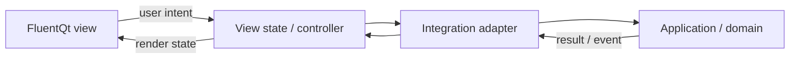

# Add a FluentQt GUI to a project

> **Status:** Current guide
>
> **Audience:** Application developers and coding agents

<!-- docs-nav:top:start -->
[Documentation](../README.md) › [AI-assisted development](README.md) › Workflow

[← FluentQt Onboarding Tools](../../tools/onboarding/README.md) · [Contents](../SUMMARY.md) · [AI-assisted development index](README.md)
<!-- docs-nav:top:end -->

Use this guide to choose the integration boundary and first complete workflow.
Use the [FluentQt Skill](../../.agents/skills/build-fluentqt-gui/SKILL.md) for
agent execution, design selection, implementation references, and acceptance
tools. For a bug fix, start from the existing interface and its owning tests;
a new application plan is unnecessary.

## Find reusable behavior

Inspect the relevant application APIs, build metadata, entry points, and tests.
A CLI or TUI can demonstrate behavior without being the architecture a GUI
should copy.

| Evidence | Decision it informs |
|---|---|
| Domain and application APIs | Which behavior can be reused without widgets |
| Process, network, persistence, and authentication calls | Where an adapter must isolate external I/O |
| Progress, cancellation, retry, and shutdown paths | Which states and lifetime rules the GUI must preserve |
| Existing frontends and host lifecycle | Which entry points and window ownership remain intact |
| Supported toolchains and packages | How to build and deliver the new interface |

Keep a task-local analysis only when it helps retain these decisions. Tools
that exchange structured analysis can use
[project-analysis.schema.json](project-analysis.schema.json).

## Choose the boundary

Use the portable Skill's
[integration boundary table](../../.agents/skills/build-fluentqt-gui/references/project-architecture.md#choose-the-integration-boundary)
to select among an in-process API, service, structured process, host extension,
extracted core, or new application. That section owns the pattern ids,
window-ownership rules, and adapter checks. The [AI tools index](README.md#find-a-component)
provides catalog queries.

## Deliver one complete workflow

Name the input, invoked operation, result, and applicable loading, empty,
failure, retry, cancellation, and cleanup paths. Build that workflow before
secondary navigation.

Application behavior stays outside signal handlers. Keep blocking work off
the GUI thread and marshal results through Qt signals or queued calls. Use
models and delegates for long or growing collections, with an explicit
retention or pagination boundary. Create one-shot surfaces on demand and
verify cleanup.

For a new GUI or major redesign, follow the Skill's
[design workflow](../../.agents/skills/build-fluentqt-gui/SKILL.md#new-or-redesigned-interfaces)
for concept comparison and human selection. Reuse an accepted direction for
focused repairs.

Select components using public headers or Python imports, Gallery examples,
and focused tests. The [AI tools index](README.md) provides setup, catalog
queries, and Inspector commands. Application patterns suggest components;
they are not mandatory screen templates.

## Verify the boundary and interface

| Layer | Evidence |
|---|---|
| Preserved interfaces | Existing behavior and regression tests |
| Adapter and view state | Applicable success, failure, cancellation, and teardown tests |
| Build and delivery | Supported build; package smoke when packaging is in scope |
| Responsiveness | Non-blocking work, bounded collections, stable scroll behavior, transient cleanup |
| Visible changes | Real Light/Dark and normal/narrow review; relevant long text, focus, input, and resize states |
| New or redesigned application | Final-build comparison with the selected concept, Inspector, architecture validation, and independent visual review |

Fix findings and review the rebuilt result. Keep engineering results, visual
acceptance, and unverified platform boundaries separate. The
[consumer visual contract](../../.agents/skills/build-fluentqt-gui/references/visual-evidence-contract.md)
defines formal application evidence; FluentQt library changes use
[repository maintainer gates](../../.agents/skills/build-fluentqt-gui/references/fluentqt-maintainer-gates.md).

<!-- docs-nav:bottom:start -->
---
[← FluentQt Onboarding Tools](../../tools/onboarding/README.md) · [Contents](../SUMMARY.md) · [AI-assisted development index](README.md)
<!-- docs-nav:bottom:end -->
