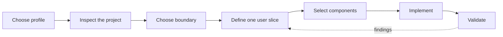
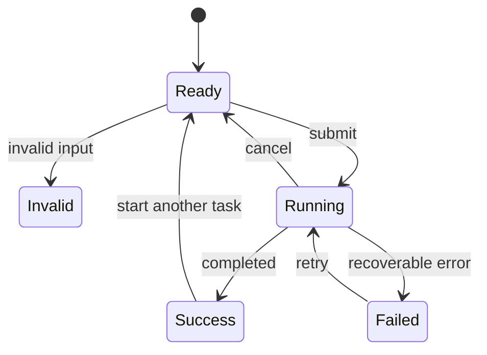
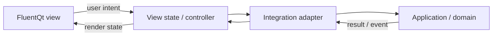

# Add a FluentQt GUI to a project

> **Status:** Current workflow
>
> **Audience:** Application developers and coding agents

<!-- docs-nav:top:start -->
[Documentation](../README.md) › [AI-assisted development](README.md) › Workflow

[← FluentQt Onboarding Tools](../../tools/onboarding/README.md) · [Contents](../SUMMARY.md) · [AI-assisted development index](README.md)
<!-- docs-nav:top:end -->

Use this workflow for an existing repository or a new application. A CLI or TUI
may reveal useful behavior, but it is not automatically the architecture the
GUI should copy. Build on reusable application behavior and public interfaces.



## 0. Choose the profile

| Profile | Use it for | Required evidence |
|---|---|---|
| `lite` | A bounded correction or small finite utility with no new shell, integration boundary, long-running work, growing collection, or complex transient surface | Real build; Light/Dark and normal/narrow review; applicable behavior tests; one finished signature surface |
| `full` | A new GUI, redesign, application shell, new integration boundary, asynchronous workflow, growing collection, or any uncertain case | Everything in `lite`, plus three comparable concepts, human selection, explicit data/lifetime design, and independent final review |

The profile changes the amount of planning evidence, not the quality bar. If a
`lite` implementation grows beyond its original boundary, reclassify it as
`full`.

## 1. Inspect the target project

Read its local instructions before choosing widgets. Record evidence for:

| Area | Questions to answer |
|---|---|
| Build and delivery | Which languages, build systems, platforms, packages, and entry points are supported? |
| Reusable behavior | Which domain or application APIs already perform the work? |
| Runtime | Which work is long-running? How do progress, cancellation, retry, and shutdown behave? |
| Boundaries | Where do filesystem, network, process, plugin, authentication, and persistence calls live? |
| Existing interfaces | Is the project a library, CLI, TUI, service, plugin, GUI, or a combination? |
| User outcome | What complete task should become easier—not merely which widgets were requested? |

For a large project, a task-local record may follow
[project-analysis.schema.json](project-analysis.schema.json). Commit it only
when it will remain useful project documentation.

## 2. Choose one integration boundary

Query the catalog before deciding:

```bash
python3 tools/ai/query_ai_catalog.py --pattern direct-library
```

| Pattern | Use it when | Boundary to preserve |
|---|---|---|
| `direct-library` | Stable behavior is callable in-process | Thread affinity, ownership, and cancellation |
| `service-api` | A service is already authoritative | Transport types stay outside widgets |
| `structured-process` | An executable is the only safe reusable surface | Structured input/output and stable errors; never terminal decoration |
| `plugin-extension` | The host supports embedded frontends | Host lifecycle, event loop, ABI/API, and unload rules |
| `extract-core` | Behavior is trapped inside another interface | Extract and test the smallest UI-independent service first |
| `greenfield` | No reusable application layer exists | Define use cases and state before composing the view |

Apply the pattern's `window_ownership` field. `host-owned` means the GUI returns
an embedded surface and does not create a second application window or event
loop. If evidence is incomplete, test a small adapter before building the full
interface.

## 3. Define one complete user slice

Describe the first slice as an observable state flow:



Remove states that cannot occur, but do not omit failure, cancellation, or
cleanup when the underlying operation supports them. Record:

- input and validation;
- the invoked use case;
- loading, progress, success, empty, and error states;
- results and persisted state;
- retry, cancellation, close, and teardown behavior.

Keep responsibilities separate:



Business rules belong in the application layer, not signal handlers. Multiple
frontends should share application behavior unless replacement is an explicit
requirement.

### Full-profile design gate

For a new GUI or major redesign, use the canonical Skill to ground the design
in the product's subject matter, create three same-content full-window
directions, and record a human selection before production UI work. The Skill
contains the complete brief fields, reference rules, comparison rubric, and
anti-genericity checks; this guide does not duplicate them.

```bash
python3 .agents/skills/build-fluentqt-gui/scripts/init_design_brief.py \
  --application "Product name" --recipe agent-run --profile full \
  --author-id "implementation-agent-id" --output /path/to/design-brief.json
python3 .agents/skills/build-fluentqt-gui/scripts/render_design_board.py \
  /path/to/design-brief.json
python3 .agents/skills/build-fluentqt-gui/scripts/validate_design_brief.py \
  --stage concepts /path/to/design-brief.json
```

`CONCEPTS READY` means “show the board for selection”; it does not authorize
implementation. Run the validator without `--stage` after the decision and
continue only when it reports `PASS`.

## 4. Select components by behavior

Start with the application pattern, then query specific needs:

```bash
python3 tools/ai/query_ai_catalog.py --pattern file-workbench
python3 tools/ai/query_ai_catalog.py --guide status-and-identity
python3 tools/ai/query_ai_catalog.py --search "determinate progress"
python3 tools/ai/query_ai_catalog.py --component info-bar
```

For each candidate, check its public header or Python import, Gallery example,
focused test, semantics, data shape, lifetime, and density. Application patterns
are shortlists, not screen templates. If FluentQt has no suitable public
component, document why a raw Qt widget remains and apply the same theme,
accessibility, and state review.

C++ applications link `FluentQt::FluentQt` and include installed headers.
Python applications use the reported `fluentqt.<category>` import and keep
PySide6, Qt, and Shiboken versions and architectures aligned.

## 5. Implement the vertical slice

1. Add the narrow adapter and test it without a window.
2. Model view states and effective transitions explicitly.
3. For an application-owned shell, install theme and Window material before
   composing content. For an embedded surface, preserve the host window.
4. Build the primary object and input path before secondary navigation.
5. Move blocking work off the GUI thread and marshal results back through Qt
   signals or queued calls.
6. Make cancellation, ownership, deferred deletion, and close behavior explicit.
7. Preserve existing entry points and regression tests.

Use Qt item models and delegates for long or growing collections. Bound the
model, transport, and cache with pagination, windowing, retention, or a proven
finite maximum. Construct one-shot dialogs and flyouts on demand; cache
repeat-use surfaces only when their state or measured creation cost justifies
it.

Show progress only when work is observable. Guard duplicate actions while work
is running, place recoverable errors near the affected workflow, and send
diagnostic detail through the project's logging boundary.

## 6. Validate the result

| Layer | Required checks |
|---|---|
| Existing behavior | Domain and existing-interface tests still pass |
| New behavior | Adapter and state tests cover applicable success, empty, validation, failure, cancellation, and teardown paths |
| Build and package | Supported build flow passes; installers or wheels include the GUI and assets when in scope |
| Responsiveness | Long work does not block the UI; growing collections stay viewport-bounded; transient instances return to baseline |
| Interaction | Keyboard focus, disabled/hover/pressed states, text input, resize, and close behavior work |
| Themes and content | Light/Dark, normal/narrow/minimum widths, long text, realistic data, and scaling are reviewed |
| Visual finish | Compare the built window with the selected concept and named Gallery references at the same theme and scale |
| Accessibility | Names, roles, focus order, hit areas, full values, and announcements match the component contracts |

Review the full window and high-risk 100% crops. Measure repeated insets,
alignment, row gaps, indicator/text spacing, and pane edges on the 4 px grid.
Fix concrete findings and recapture the same states; scaled-down screenshots
can hide small defects.

For final visual evidence, render a comparison board and use a human or fresh
agent—not the implementation author—for the recorded review:

```bash
python3 .agents/skills/build-fluentqt-gui/scripts/render_visual_review.py \
  /path/to/visual-evidence.json
python3 .agents/skills/build-fluentqt-gui/scripts/validate_visual_evidence.py \
  --require-current /path/to/visual-evidence.json
```

For changes to FluentQt's AI contract, also run:

```bash
python3 tools/ai/validate_ai_assets.py --project-root .
```

Report the chosen boundary and evidence, preserved interfaces, completed user
slice, commands run, visual coverage, and any platform or packaging boundary
that was not verified. Do not present feasibility as verified support.

<!-- docs-nav:bottom:start -->
---
[← FluentQt Onboarding Tools](../../tools/onboarding/README.md) · [Contents](../SUMMARY.md) · [AI-assisted development index](README.md)
<!-- docs-nav:bottom:end -->
