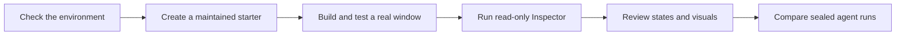

# AI delivery record

> **Status:** Historical record, closed on 2026-08-25
>
> **Current guidance:** [AI-assisted GUI development](../ai/README.md)

<!-- docs-nav:top:start -->
[Documentation](../README.md) › [Development](README.md) › Baselines and historical records

[← FluentQt 1.7 delivery record](release-1.7-roadmap.md) · [Contents](../SUMMARY.md) · [Development index](README.md) · [WebAssembly delivery record →](webassembly-roadmap.md)
<!-- docs-nav:top:end -->

This record explains what FluentQt delivered to shorten the path from a
repository to a reviewed desktop interface. It preserves dated acceptance
evidence; generated catalogs and current guides remain the source of truth for
today's API surface.

## Delivery loop

## Product boundary

The work supports three cases:

- modernize an existing Qt Widgets application;
- add a native desktop client to a library, CLI, TUI, service, data tool, or
  agent;
- build the same interface through PySide6 while retaining the native FluentQt
  implementation.

It did not add another design language, a QML/mobile renderer, business logic,
or a hosted source-code service. Source, screenshots, and usage data remain
local unless a user deliberately publishes them.

## Delivered outcomes

| Area | Result | Current entry point |
|---|---|---|
| Environment | Read-only C++ and Python doctor with human and JSON output | [Onboarding tools](../../tools/onboarding/README.md) |
| Project creation | Maintained `existing-qt` and `workbench` starters for C++ and PySide6 | `fluentqt create` |
| First window | `fluentqt trial` checks, creates, builds, tests, and reaches the real `show()` path | `fluentqt trial` |
| API discovery | Searchable public API and a queryable machine catalog | [API Explorer](https://calvinhxx.github.io/Fluent-Qt/api/) · [AI catalog](../ai/generated/fluentqt-ai-catalog.json) |
| Built-app diagnostics | One read-only native Inspector used by C++ and PySide6 | [Inspector contract](../architecture/inspector-report.md) |
| Visual review | Versioned application scenes plus a manual IME compatibility check | [Scene manifest](../ai/evals/application-scenes.json) |
| Agent workflow | One portable `build-fluentqt-gui` Skill shared by compatible agents | [Skill](../../.agents/skills/build-fluentqt-gui/SKILL.md) |

## Acceptance evidence

### First-window trials

[Full CI run #32654501221](https://github.com/calvinhxx/Fluent-Qt/actions/runs/32654501221)
passed all five clean C++ consumer environments across Linux x64/ARM64, Qt 5/6,
macOS, and Windows. The median time from a ready doctor result to the first
window path was 9.692 seconds. Linux, Windows, and macOS Python wheel lanes also
passed, with a 0.546-second median.

These figures measure the maintained starter on the recorded CI machines. They
do not include package acquisition and are not general application startup
benchmarks.

### Application scenes

The scene manifest defines fourteen checks across Gallery and the generated C++
and PySide6 Workbenches:

- thirteen deterministic scenes cover Light/Dark, width changes, empty,
  loading, error, long text, dense data, and scroll boundaries;
- one native IME scene remains a manual platform check because the candidate
  window belongs to the operating system and input method.

The automated scenes passed with zero Inspector findings at closeout. Inspector
findings are engineering signals, not a substitute for visual judgment.

### Cross-agent comparison

Codex and Cursor used the same source commit, Qt/FluentQt prefix, Skill archive,
content fixtures, and review rubric. Their terminal manifests and referenced
artifacts were sealed with content hashes before comparison.

| Run | Tests and structure | Inspector | Visual review |
|---|---|---:|---:|
| Codex, selected Concept A | 3/3 CTest and strict evidence checks passed | 0 findings | 36/45; every dimension 4/5 |
| Cursor, clean rerun | 6/6 CTest and strict evidence checks passed | 0 findings | 36/45; every dimension 4/5 |

Five state-matched final-build pairs were reviewed under randomized X/Y labels.
The Codex build was preferred in all five comparisons. This is a relative result
for two recorded runs, not an industry benchmark or proof that one agent is
generally better.

No external model credential was used during the fixture-backed workflow. The
result covered process integration, streaming events, cancellation, and retry;
it did not claim a live provider call.

## Measures used at closeout

| Measure | Gate | Recorded result |
|---|---:|---:|
| Median trial time after doctor passes | under 10 minutes | passed |
| Clean-environment build success | at least 85% | 100% |
| Workflow completion | at least 80% | 100% |
| Blind visual review | every dimension at least 4/5 | passed |
| Same-package pairwise preference | winning result at least 70% | 100% in 5 comparisons |
| Open blocker or major findings | 0 | 0 |

These were project closeout gates, not broad claims about the software industry.

## What remains current

- Generated API and component facts come from the
  [AI catalog](../ai/generated/fluentqt-ai-catalog.json) and
  [API catalog](../../site/api/catalog.json).
- Workflow instructions live in [AI-assisted GUI development](../ai/README.md)
  and the canonical Skill.
- Dated performance measurements live in
  [Production Evidence Baselines](production-evidence.md).
- VoiceOver and native IME behavior remain platform-specific manual release
  checks.

New registries, Figma integration, MCP services, telemetry, or broader adoption
tracking should be separate projects with an explicit user need and privacy
boundary; they are not unfinished phases of this record.

<!-- docs-nav:bottom:start -->
---
[← FluentQt 1.7 delivery record](release-1.7-roadmap.md) · [Contents](../SUMMARY.md) · [Development index](README.md) · [WebAssembly delivery record →](webassembly-roadmap.md)
<!-- docs-nav:bottom:end -->
