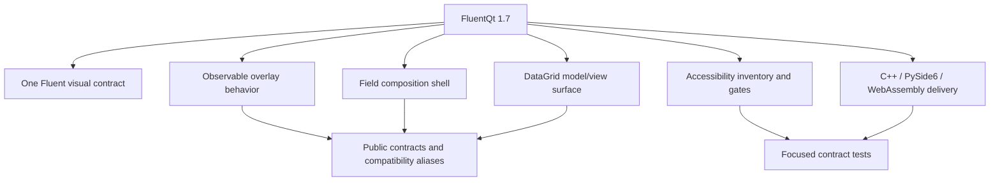
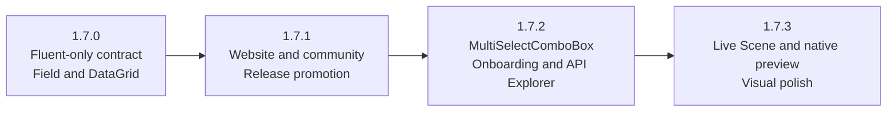

# FluentQt 1.7 delivery record

> **Status:** Historical record
>
> **Closeout snapshot:** `release/1.7.x`, 2026-08-17
>
> **Current release notes:** [1.7 series](../releases/README.md)

<!-- docs-nav:top:start -->
[Documentation](../README.md) › [Development](README.md) › Baselines and historical records

[← Production Evidence Baselines](production-evidence.md) · [Contents](../SUMMARY.md) · [Development index](README.md) · [AI delivery record →](adoption-and-ai-roadmap.md)
<!-- docs-nav:top:end -->

This document records why the 1.7 work was organized and how the initial 1.7.0
release was accepted. It is not the current component inventory. Use generated
catalogs and the active development guides for current facts.

## Release shape

## Shipped outcomes

| Track | Outcome | Canonical reference |
|---|---|---|
| Fluent-only product contract | Removed Material/Cupertino selectors, paint branches, Gallery choices, bindings, and assets | [Fluent design contract](../design-languages/README.md) |
| Overlay semantics | Defined logical open state, lifecycle order, close reasons, re-entrancy, and modal/dim/close-policy boundaries | [Overlay behavior](../architecture/overlay-behavior.md) |
| Field | Added a value-neutral label, editor, helper, validation, focus, and accessibility composition shell | [Field contract](field-api-proposal.md) |
| DataGrid | Added a caller-owned model/view grid with bounded visible work, interaction, accessibility, and delegate editing | [DataGrid contract](datagrid-api-proposal.md) |
| Accessibility | Classified every visible public component and added risk-ordered semantic gates | [Accessibility inventory](accessibility-inventory.md) |
| Community | Added structured bug, feature, Q&A, idea, and show-and-tell intake | [Community](../community/README.md) |
| Delivery | Verified native C++, PySide6, WebAssembly, Gallery, generated catalogs, and representative visuals | [1.7.0 release notes](../releases/v1.7.0.md) |

## Contract boundaries

### Overlays

- `isOpen` is the logical requested state; it is distinct from widget
  visibility and animation completion.
- Popup, Flyout, Dialog, ContentDialog, and TeachingTip follow the documented
  lifecycle and effective-change-only notification rules.
- `modal`, `dim`, and `closePolicy` remain independent.
- Compatibility aliases remain until a major-version migration permits removal.
- The coordinator is private and same-window overlays do not become native
  dialog or tool windows.

### Field

- Field presents context around an editor; it does not own the editor's value,
  validator, or business rules.
- Owned, borrowed, and reparented editor lifetimes are explicit in C++ and
  PySide6.
- Focus and accessibility relationships are part of the component contract,
  not Gallery-only behavior.

### DataGrid

- Models, selection models, delegates, sorting, and persistence remain
  caller-owned.
- Work and retained objects scale with the visible viewport rather than the
  total model size.
- Editing uses real delegates with commit, cancel, rejection, validation, and
  cleanup contracts.
- C++ and PySide6 expose the same ownership boundary; WebAssembly exercises the
  same C++ implementation.

## Non-goals

- A WebView dependency in the reusable Qt Widgets library.
- A QML, mobile, Material, or Cupertino renderer.
- One inheritance hierarchy for every overlay-like component.
- Per-cell `QWidget` or Field instances in DataGrid.
- A hosted CI pixel-diff gate without a controlled approval host.
- Ending representative Qt 5.15 compatibility sampling.

## 1.7.0 closeout evidence

The following values are a dated snapshot, not current totals:

| Surface | 2026-08-17 result |
|---|---|
| Native C++ local full profile | 1471/1471 tests passed; interactive and platform-only checks skipped by contract |
| PySide6 | 95 registered tests passed |
| WebAssembly | Full 90-route browser smoke passed, including DataGrid interaction |
| Accessibility | 69 visible components classified, with zero recorded gaps |
| Generated AI assets | 69 components and 205 samples validated |
| Manual review | C++, Python, and WebAssembly Galleries accepted before release commits were split |

Patch releases changed those totals. Current component, route, sample, header,
and accessibility facts live in the [generated AI catalog](../ai/generated/fluentqt-ai-catalog.json),
[API catalog](../../site/api/catalog.json), and
[accessibility inventory](accessibility-inventory.md).

## Later 1.7 releases

- [1.7.0](../releases/v1.7.0.md)
- [1.7.1](../releases/v1.7.1.md)
- [1.7.2](../releases/v1.7.2.md)
- [1.7.3](../releases/v1.7.3.md)

Future 1.7.x work belongs in release notes and current contracts rather than in
this closed record.

<!-- docs-nav:bottom:start -->
---
[← Production Evidence Baselines](production-evidence.md) · [Contents](../SUMMARY.md) · [Development index](README.md) · [AI delivery record →](adoption-and-ai-roadmap.md)
<!-- docs-nav:bottom:end -->
